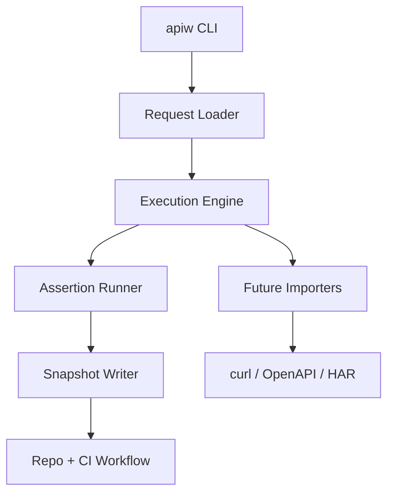

# api-workbench

CLI-first API workbench for repo-native API testing and automation.

`api-workbench` is for developers who want API checks to live in Git, run in the terminal, and stay usable in CI.

## Positioning

`api-workbench` is built around a simple idea:

- Requests should live in a repository, not inside a desktop app.
- Terminal usage should be the default, not an afterthought.
- The same request definition should run locally and in CI.
- Snapshots should make API behavior changes easy to inspect.

It sits in the gap between `curl`, Postman-style apps, and ad-hoc CI smoke tests:

- lighter than GUI-first API clients
- more structured than shell scripts
- more reviewable than app-local collections

## Architecture



## Current MVP

This first milestone focuses on a narrow MVP:

- `apiw init` creates a repo-friendly project layout.
- `apiw run` executes a request spec from disk.
- Environment values come from `.env`-style files plus process env vars.
- Assertions validate the response.
- Snapshots can be written to disk for later diffing.

## Current MVP Scope

The current request format is JSON-only by design. YAML and collection-level commands can come later once the execution core is stable.

Implemented now:

- Project bootstrap
- Request execution
- Collection execution via `apiw run --all`
- Header / query / body templating via `${VAR}`
- Basic assertions
- Snapshot writing

Planned next:

- OpenAPI / `curl` import
- Snapshot diff
- Machine-readable CI output
- Optional TUI / desktop shell

## Install

```bash
go build -o bin/apiw ./cmd/apiw
```

Or install it directly into your Go bin path:

```bash
go install github.com/MakiDevelop/api-workbench/cmd/apiw@latest
```

If you only built the local binary, use `./bin/apiw` or the full binary path in the examples below.

## Quick Start

### 1. Bootstrap a repo

```bash
mkdir my-api-checks
cd my-api-checks
apiw init
```

### 2. Point it at an API

```bash
cat > .apiw/env/local.env <<'EOF'
BASE_URL=https://httpbin.org
EOF
```

Generated structure:

```text
.apiw/
  apiw.json
  env/
    local.env
  snapshots/
requests/
  health.json
```

### 3. Run a single request

```bash
apiw run requests/health.json --env local --snapshot
```

### 4. Run a whole collection

```bash
apiw run --all requests --env local
```

## Example Output

```text
file           requests/health.json
request        GET https://httpbin.org/status/200
status         200
duration       45ms
snapshot       .apiw/snapshots/health-check--local.json

summary        total=1 passed=1 failed=0 transport=0 invalid=0
```

## Example Collections

- [`examples/httpbin/README.md`](examples/httpbin/README.md): copy-paste example for first-time users
- [`examples/httpbin/requests/status-200.json`](examples/httpbin/requests/status-200.json): minimal status check
- [`examples/httpbin/requests/headers.json`](examples/httpbin/requests/headers.json): header + body assertions

## Request Spec

Example `requests/health.json`:

```json
{
  "name": "health-check",
  "method": "GET",
  "url": "${BASE_URL}/health",
  "headers": {
    "Accept": "application/json"
  },
  "query": {
    "source": "apiw"
  },
  "assertions": [
    {
      "type": "status",
      "equals": 200
    }
  ]
}
```

Supported assertion types:

- `status`
- `body_contains`
- `header_equals`

Optional body format:

```json
{
  "body": {
    "type": "json",
    "content": {
      "message": "hello"
    }
  }
}
```

For plain text:

```json
{
  "body": {
    "type": "text",
    "content": "hello"
  }
}
```

## Commands

```bash
apiw init
apiw run requests/health.json --env local
apiw run --all --env staging
apiw run requests/create-user.json --env staging --snapshot
```

## Docs

- [Onboarding Guide](docs/onboarding.md)
- [CLI Design](docs/cli.md)
- [MVP Plan](docs/mvp.md)
- [Roadmap](docs/roadmap.md)
- [Growth Strategy](docs/growth.md)
- [Open-Core Strategy](docs/open-core.md)
- [Tutorial Draft](docs/tutorial.md)

## Open-Core Direction

The open-source core should remain the best way to:

- define repo-native request collections
- run assertions locally and in CI
- capture snapshots and compare API behavior over time

Commercial or hosted layers, if added later, should focus on:

- team workspaces
- hosted run history
- flaky endpoint analytics
- policy packs and access control

The goal is to keep the developer workflow open while reserving team-scale operations for a future paid layer.
